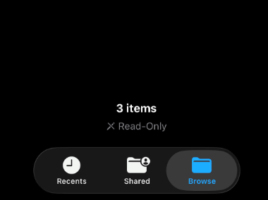
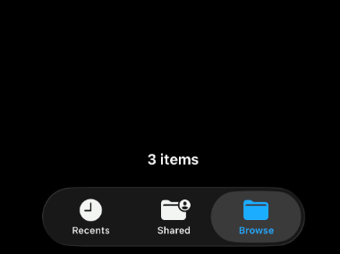

+++
title = "iOS Device Showing Read-Only on Read-Write SMB / Samba Share"
date = "2026-03-11T17:50:19-04:00"
author = "Braden"
cover = ""
tags = ["ios", "samba"]
keywords = ["ios", "samba"]
description = "When accessing a SMB/Samba share on an iOS device, the directories load as read-only despite the user having read and write access to the directory. A simple config line in smb.conf fixes the issue."
showFullContent = false
readingTime = false
hideComments = false
+++

# The Issue

Despite ```read only = no``` being set on a Samba share in ```/etc/samba/smb.conf```, iOS shows a "Read-Only" flag with a crossed out pencil icon on any folder in the share when I access it from my Apple iPhone.



I previously used TrueNAS Samba shares and this was never an issue so I went to the Googles and found out why.

# The Solution

Thanks to a helpful discussion on Apple Community[^1] as well as a blog article by fernvenue[^2], I was able to identify the problem.

Simply edit the ```/etc/samba/smb.conf``` file and add the line below to the ```[global]``` section (or under an individual share if you prefer).

```bash
vfs objects = streams_xattr
```

The SambaWiki[^3] explains the behavior with:

- "The streams_xattr Virtual File System (VFS) module enables applications to store information in Alternative Data Streams (ADS). Certain applications, such as the Microsoft Edge browser, require ADS to operate correctly. For example, if you use Edge to download a file to a Samba share that has no ADS support enabled, the download will fail."

After editing, restart or reload the Samba config.

```bash
smbcontrol all reload-config
```

Disconnect and reconnect from the SMB share on iOS and the ```read-only``` flag should disappear.



###### Sources

[^1]:https://discussions.apple.com/thread/255775451
[^2]:https://blog.fernvenue.com/archives/samba-read-only-issue-on-ios
[^3]:https://wiki.samba.org/index.php/Using_the_streams_xattr_VFS_Module